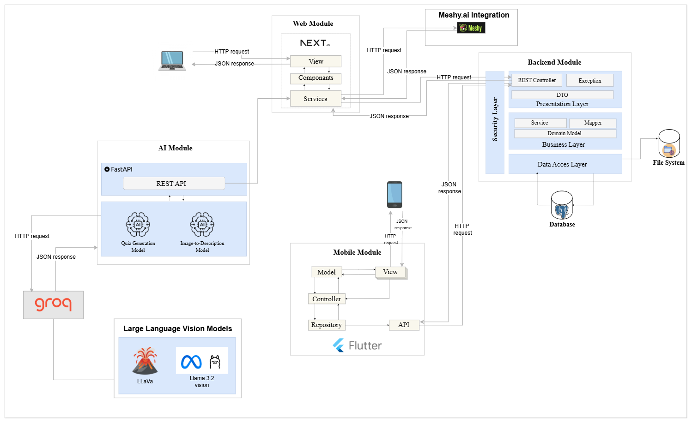

# TerraViva: AI-Enhanced 3D Learning Platform for Medical Education


### Overview
TerraViva is a revolutionary educational technology platform designed to transform medical education through immersive, AI-powered learning experiences. By leveraging cutting-edge technologies, the platform bridges the gap between traditional learning methods and modern, interactive educational approaches.





### Global Description
In the rapidly evolving landscape of medical education, TerraViva emerges as a comprehensive solution that addresses critical challenges:
- Limited interactivity in traditional learning materials
- Difficulty in visualizing complex anatomical structures
- Lack of personalized learning experiences
- Inefficient content creation and management

Our platform integrates advanced technologies to create a holistic learning ecosystem:
- **AI-Powered Content Generation**: Automatic 3D model creation and quiz generation
- **Multi-Platform Accessibility**: Web and mobile interfaces
- **Role-Based Learning Management**: Tailored experiences for administrators, professors, and students
- **Interactive 3D Visualization**: High-fidelity model exploration


## Table of Contents
1. [Project Structure](#project-structure)
2. [System Architecture](#system-architecture)
3. [Core Functionalities](#core-functionalities)
4. [Installation and Setup](#installation-and-setup)
5. [Docker Deployment](#docker-deployment)
6. [Illustrative Examples](#illustrative-examples)
7. [Video Demonstration](#video-demonstration)
8. [Contributors](#contributors)


## Project Structure

The TerraViva project is organized into four main branches:

```
TerraViva-Project/
│
├── frontend/           # Next.js Web Application
│   ├── app/
│   ├── components/
│   ├── sections/
│   └── services/
│
├── backend/            # Spring Boot Backend
│   ├── src/
│   │   ├── main/
│   │   │   ├── java/
│   │   │   └── resources/
│   │   └── test/
│   └── pom.xml
│
├── mobile/             # Flutter Mobile Application
│   ├── lib/
│   ├── test/
│   └── pubspec.yaml
│
└── terraviva_ai/       # FastAPI AI Services
    ├── app.py
    |── Obj3dTextGenerator.py
    |── helpers.py
    |── QuizGeneratorPipeline.py
    └── requirements.txt
```
### System Architecture


### Core Functionalities

1. **Frontend (Web Interface)**
   - Responsive admin and professor dashboard
   - User authentication
   - Interactive data visualization
   - State management

2. **Backend (Spring Boot)**
   - RESTful API development
   - User management
   - Database interactions
   - Business logic implementation

3. **Mobile (Flutter)**
   - Cross-platform mobile application
   - 3D object interaction
   - Offline capabilities
   - Student-focused interface

4. **TerraViva AI (FastAPI)**
   - AI model integration
   - Quiz generation
   - Descriptive content creation

5. **Meshy.ai**
   - Image-to-3D generation

## Installation and Setup

### Prerequisites
- Git
- PostgreSQL (version 17.0)
- Node.js (version 20.10.0)
- Java Development Kit 17
- Flutter SDK
- Python 3.10+

### Comprehensive Setup Guide

1. **Clone the Project Using Git Worktree**
```bash
# Create a main project directory
mkdir terraviva
cd terraviva

# Clone the main repository
git clone https://github.com/mohamed2020m/TerraViva-Project.git
cd TerraViva-Project

# Create separate worktrees for each branch
git worktree add ../frontend frontend
git worktree add ../backend backend
git worktree add ../mobile mobile
git worktree add ../terraviva_ai terraviva_ai
```

2. **Backend Setup**
```bash
# Navigate to backend directory
cd ../backend

# Configure PostgreSQL connection in application.properties
# Ensure database 'terraviva' is created

# Install dependencies and build
mvn clean install

# Run Spring Boot application
mvn spring-boot:run
```

3. **Frontend Setup**
```bash
# Navigate to frontend directory
cd ../frontend

# Install dependencies
npm install

# Run development server
npm run dev
```

4. **AI Services Setup**
```bash
# Navigate to AI services directory
cd ../terraviva_ai

# Create virtual environment (optional but recommended)
python3 -m venv venv
source venv/bin/activate

# Install dependencies
pip install -r requirements.txt

# Run FastAPI services
python app.py
```

5. **Mobile Application**
```bash
# Navigate to mobile directory
cd ../mobile

# Get Flutter dependencies
flutter pub get

# Run on connected device or emulator
flutter run
```

## Docker Deployment

### Prerequisites
- Docker
- Docker Compose
- Minimum system requirements:
  - 8GB RAM
  - 4 CPU cores
  - 20GB free disk space

### Docker Compose Configuration

```yaml

```

## Illustrative Examples

## Video Demonstration

### Mobile Demo

<p align="center">
   <video width="320" height="440" controls poster="./assets/images/play.gif">
      <source src="https://youtu.be/Uo_EKDMx88w" type="video/mp4">
      Your browser does not support the video tag.
   </video>
</p>

### Web Demo

TODO:

## Contributors


| Name                     | GitHub                                                                                         | LinkedIn                                                                                       | Website                                                                                       |
|--------------------------|------------------------------------------------------------------------------------------------|-----------------------------------------------------------------------------------------------|-----------------------------------------------------------------------------------------------|
| Mohammed Belkarradi      |  [GitHub](#)                         |  [LinkedIn](#)           |  [Website](#)                          |
| Abderrahmane Ouaday      |  [GitHub](#)                         |  [LinkedIn](#)           |  [Website](#)                          |
| Mohamed Essabir          |  [GitHub](https://github.com/mohamed2020m) |  [LinkedIn](https://www.linkedin.com/in/mohamed-essabir) |  [Website](https://leeuw.vercel.app/) |


  
## License
MIT License (See LICENSE file in repository)
